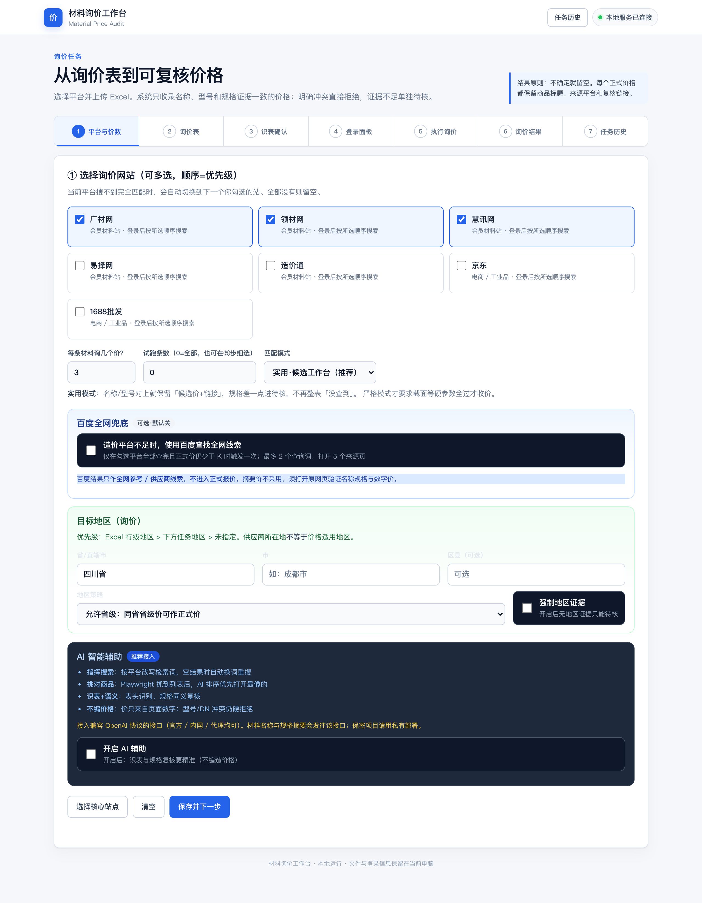
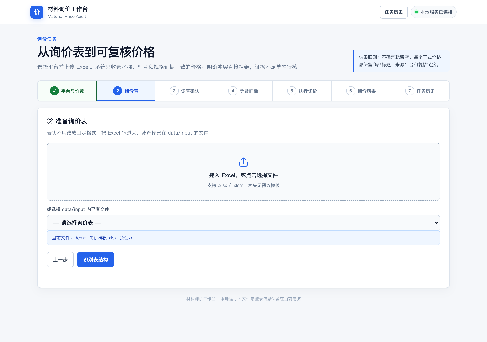
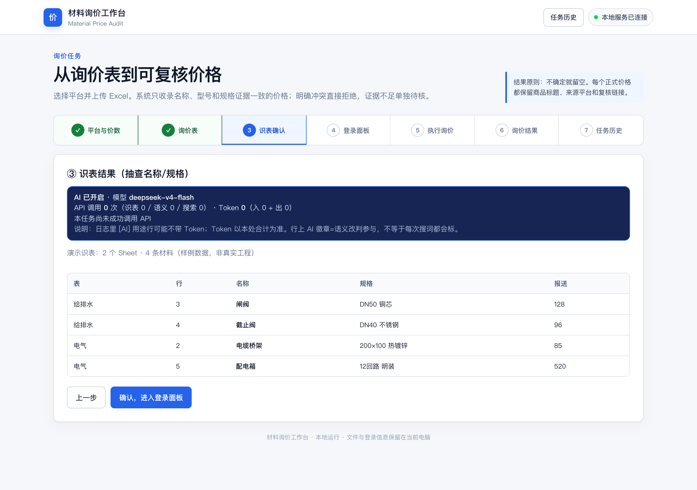
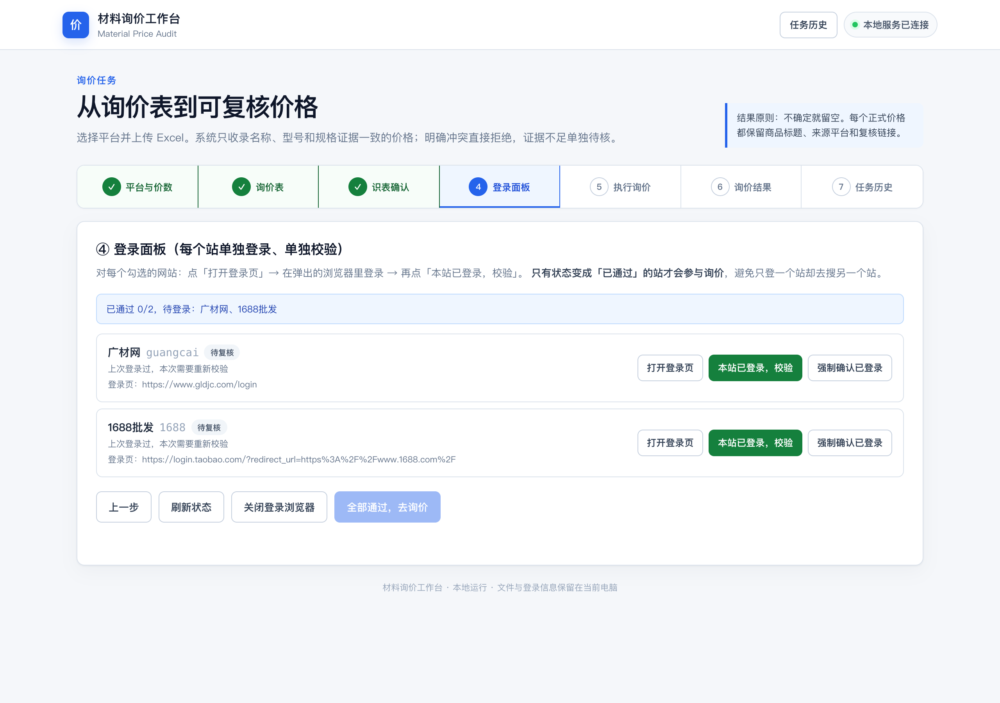
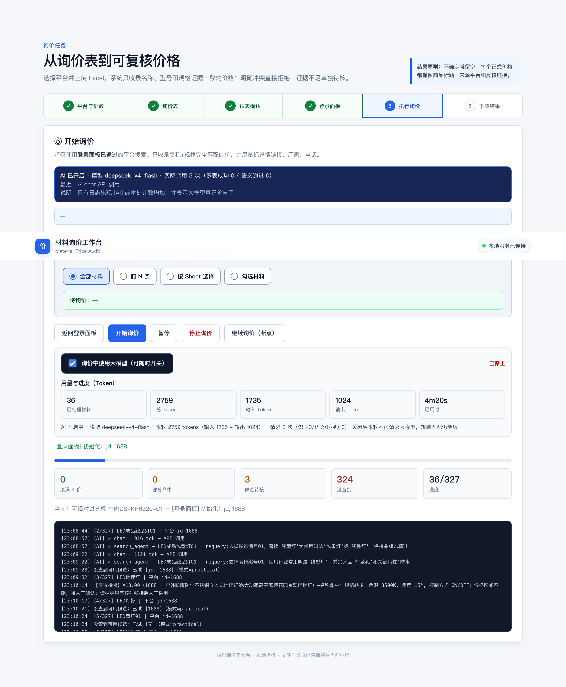
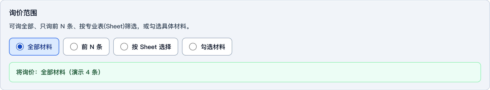
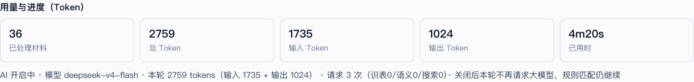
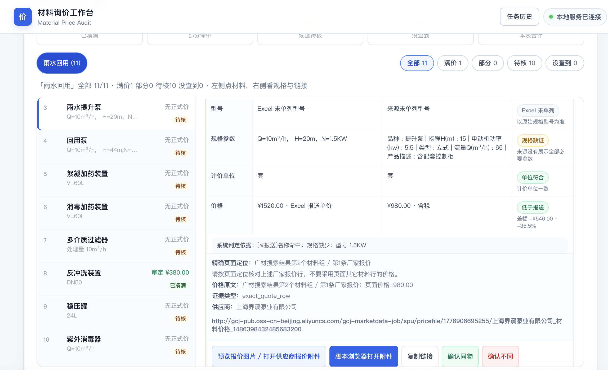

# Material Price Audit · 材料询价工作台

[](https://www.python.org/)
[](./LICENSE)
[](#快速开始)

**造价员用的本地材料询价助手**：上传任意表头的询价 Excel → 勾选广材/慧讯/领材/易择/造价通/京东/1688 → 浏览器登录 → 瀑布 / 多站并行搜价 → 导出比价表与 RFQ。

- 主入口是 **Web 向导**（不是命令行堆参数）
- 默认监听 **`127.0.0.1:8765`**，数据与登录 Cookie 只留在本机
- **不编造价格**：价只来自页面；硬规格冲突不会被 AI 强行放行
- **结果须自行核对**：绿/黄/灰与链接仅为检索底稿，正式采用前请打开原站核对名称、规格、单位与含税口径
- **接入大模型可提高检索成功度**（改词、排序、识表、语义复核）；默认关闭，开启后仍**不改价格数字**
- **登录可恢复**：Cookie 落在 `.browser-profile`；询价中若需重登，点 **「我已登录，继续」**

<p align="center">
  
</p>

> 上图及下文截图均由 Playwright 对本地运行的向导 **真实截屏**（`scripts/capture_screenshots.py`），样例材料名为演示数据，非 AI 生成界面图。

---

## 目录

- [它解决什么问题](#它解决什么问题)
- [功能一览](#功能一览)
- [快速开始](#快速开始)
- [图文教程（Web 向导六步）](#图文教程web-向导六步)
- [匹配模式说明](#匹配模式说明)
- [输出文件](#输出文件)
- [隐私与安全（请勿上传）](#隐私与安全请勿上传)
- [平台](#平台)
- [可选配置 / LLM](#可选配置--llm)
- [开发与截图](#开发与截图)
- [合规边界](#合规边界)
- [京东 / 1688 策略](#京东--1688-策略)
- [若亘其它产品](#若亘其它产品)
- [如果帮到了你](#如果帮到了你)

---

## 它解决什么问题

传统做法：打开广材/慧讯等网站，逐条搜材料、对规格、抄价、回填 Excel——慢、易漏、难留证据链。

本项目把流程收成 **本地 Web 工作台**：

```text
询价 Excel（表头随意）
    → 识表 / 标准化材料行
    → 勾选平台 + 分站登录（Cookie 在 .browser-profile）
    → 按优先级瀑布搜索（多站时可 Worker 并行）
    → 名称 + 硬规格校验（型号/截面/电压…）
    → 正式合格价 / 候选待核 / 没查到
    → result.xlsx + rfq.xlsx + evidence.json
```

**设计原则：**

| 原则 | 说明 |
|------|------|
| 浏览器向导优先 | 日常只用 `serve`，在页面完成全流程 |
| 严格不编价 | 列表/详情抓到的数字才是价；LLM **不参与定价、不改数字** |
| 人机复核 | 程序加速搜与对齐；**最终是否采用由造价员自己核对**（点链接看原页） |
| AI 提检索、不替你拍板 | 接入大模型后：改写检索词、列表排序、表头识别、规格同义复核 → **更容易搜到、更少漏检**；仍须人工确认 |
| 候选工作台 | 默认「实用」模式：名字对上但规格差一点 → 黄条待核，可人工采用 |
| 可中断可续登 | 暂停 / 停止 / 断点继续；登录失效可重登后点「我已登录，继续」 |
| 会话真校验 | 会员站禁止空「强制确认」；启动前复检 Cookie，避免假登录白跑 |

---

## 功能一览

### Web 向导

1. **选平台 + 匹配模式 + 可选 AI**  
2. **上传 / 选择 Excel**（无需固定模板）  
3. **识表预览**（按 Sheet 抽查名称规格）  
4. **分站登录校验**（只登勾选的站；校验页探测 Cookie / 正向文案）  
5. **询价范围**（全部 / 前 N / Sheet / 勾选）+ **暂停/停止/继续** + **「我已登录，继续」** + **Token 用量**  
6. **结果**（绿合格 / 黄候选 / 灰没查到）+ 下载 Excel / RFQ + 任务历史  

### 匹配、调度与登录

- 匹配档位：`practical`（默认）· `strict` · `loose`  
- 硬规则：型号、截面尺寸、电压/功率/IP、单位同类（节/台/个）等  
- **名称/规格流水线**、材料族候选池（同族复用检索）、可选地区门控  
- **平台调度**：一平台一 Worker，Cookie 注入并行；限流/验证码/登录熔断  
- **慧讯**：关窗重开自动「一键登录 → 继续登录」  
- **造价通**：列表以 HTTP SSR 为主，避免 SPA 踢登录死循环  
- **领材**：双重 URL 编码；`userInfo` 不当成已离开登录；需真实会话 Cookie  
- 运行中：暂停 / 停止 / 断点续跑 / 开关大模型 / Token 统计 / 登录等待放行  

---

## 快速开始

**环境：** Python 3.10+，本机 Chrome / Chromium 推荐。

### 下载安装包（推荐）

到 [GitHub Releases](https://github.com/AroganY/material-price-audit/releases) 或 [Gitee Releases](https://gitee.com/arogan/material-price-audit/releases) 下载 **`material-price-audit-*-portable.zip`**，解压后：

```bash
# macOS / Linux
chmod +x install.sh start.sh
./install.sh    # 首次
./start.sh      # 启动向导
```

```powershell
# Windows
.\install.ps1
.\start.ps1
```

中文安装说明见 [INSTALL.zh.md](./INSTALL.zh.md)。

### 从源码安装

```bash
git clone https://github.com/AroganY/material-price-audit.git
# 或：git clone https://gitee.com/arogan/material-price-audit.git
cd material-price-audit

python3 -m venv .venv
source .venv/bin/activate          # Windows: .venv\Scripts\activate

pip install -e .
python -m playwright install chromium

# 启动本地向导（默认只绑 127.0.0.1）
python -m material_price_audit serve --host 127.0.0.1 --port 8765
```

浏览器打开：**http://127.0.0.1:8765/**

把询价表放到 `data/input/`（任意文件名 `.xlsx`），或在页面里直接上传。

更细的命令与排错见 [docs/WEB_GUIDE.md](./docs/WEB_GUIDE.md)。

---

## 图文教程（Web 向导六步）

### ① 选择平台与模式

勾选要比的网站（顺序 = 优先级）。设置每条材料要几个价、匹配模式（推荐 **实用·候选工作台**）。可选开启 AI（仅辅助识表/灰区，**不改价格**）。


### ② 准备询价表

拖入或选择 `data/input` 内 Excel。表头无需改成固定模板。



### ③ 识表确认

检查名称 / 规格 / 报送价是否识别正确。可按 Sheet 切换预览。



### ④ 登录面板

每个站：**打开登录页 → 在弹出浏览器登录 → 本站已登录，校验**。  
只有「已通过」的站才会参与询价。Cookie 只在本机 `.browser-profile/`。

- 请在 **工具弹出的浏览器** 登录（不要只用系统自带 Chrome）  
- 会员站（广材/领材/慧讯/易择/造价通）**不能**靠空「强制确认」凑数——必须探测到会话 Cookie 或已登录文案  
- 校验失败时：重新在弹出窗口登录后再点校验  



### ⑤ 执行询价

- **询价范围**：全部 / 前 N 条 / 按 Sheet / 勾选材料  
- **暂停 / 停止 / 继续（断点）**  
- **「我已登录，继续」**：询价中某站会话失效时，在弹出浏览器登完后点此按钮（或 `touch data/output/LOGIN_CONTINUE`）  
- **询价中开关 AI** + **Token 用量**（输入 / 输出 / 合计）



| 询价范围面板 | Token 用量 |
|--------------|------------|
|  |  |

### ⑥ 查看结果

- **绿**：规则判定较齐的正式价 —— **仍建议点开链接核对**（名称、规格、单位、含税）  
- **黄·候选待核**：有价有链接，规格可能差一截 → **必须**点链接人工确认后再采用  
- **灰**：本轮未找到可用候选  

> **重要：** 导出的 Excel / 页面结果是**询价与审核底稿**，不是终审定稿。平台页面会改版、同名不同规、含税口径不一，**请自行核对后再写入正式造价成果**。  
> 若检索「老搜不到 / 灰区多」，在第①步 **开启 AI 辅助并配置可用大模型**：可明显提高改词命中与列表挑选成功率（Token 有用量与熔断保护）；**AI 仍不会编造或改写价格数字**。

下载 `result.xlsx` / `rfq.xlsx`。停止任务后也会进入结果页展示**已完成部分**。历史任务可在向导内查看。



---

## 匹配模式说明

| 模式 | 行为 | 适用 |
|------|------|------|
| **实用 practical（默认）** | 名称/型号对上 → 可进候选价；截面等硬冲突不直接当合格价，但**不丢链接** | 日常询价、同型号多规格 |
| **严格 strict** | 硬规格必须全过才收正式价 | 审计留痕、宁可空也不错 |
| **宽松 loose** | 名称弱匹配也可进候选 | 只求市场区间参考 |

### 市场价与报送价解耦

| 规则 | 行为 |
|------|------|
| **名称 + 规格匹配** | 唯一决定是否收录**正式市场报价**；与报送价无关 |
| **市场价高于报送** | 仍收录，标记 `above_submit`，Excel 显示偏差%与异常提示 |
| **市场价远低于报送** | 仍收录，标记 `suspicious_low`（请核对规格/单位），**不删除** |
| **`never_exceed_submit`** | **只**影响「参考审定不含税」封顶 `min(最低市场不含税, 报送)`，**不**过滤市场报价 |
| **京东 / 1688** | 仍只进 **电商参考**（`market_ref`），不作造价站合格价 |

程序**不会**用报送价去编造市场价，也**不会**因超报送而把精确匹配报成「没查到」。

---

## 输出文件

| 路径 | 说明 |
|------|------|
| `data/output/result.xlsx` | 询价比价结果（市场价 1～K、与报送关系、偏差%、异常、审定参考、候选、链接） |
| `data/output/rfq.xlsx` | 未凑满/需继续问厂家的材料 |
| `data/output/evidence.json` | 机器可读过程证据（拒绝原因、尝试记录） |
| `data/user/settings.json` | 本机偏好（平台、K、匹配模式、AI Key） |
| `.browser-profile/` | 浏览器登录态（**绝对不要提交 Git**） |

---

## 隐私与安全（请勿上传）

以下内容**仅本机使用**，仓库已用 `.gitignore` 排除，请勿贴到 Issue/PR；发版截图务必用演示数据：

| 内容 | 路径 / 说明 |
|------|-------------|
| 登录 Cookie | `.browser-profile/` |
| 真实询价表 | `data/input/*`、任意 `*.xlsx` |
| 询价结果 / 证据 | `data/output/*`（除 `.gitkeep`） |
| 用户设置 / API Key | `data/user/` |
| 本地配置 | `config.yaml`（请用 `config.example.yaml` 作模板） |
| 映射缓存 | `data/mapping-cache/` |

发版或截图前建议：

```bash
# 用演示数据重截（脚本内置样例行，不读你的真实结果）
python -m material_price_audit serve --host 127.0.0.1 --port 8765
python scripts/capture_screenshots.py
```

安全策略详见 [SECURITY.md](./SECURITY.md)。

---

## 平台

| ID | 名称 | 说明 |
|----|------|------|
| `guangcai` | 广材网 | 会员市场价 / 厂家报价行 |
| `lingcai` | 领材网 | 市场价；双重 URL 编码；登录需真实 Cookie |
| `huixun` | 慧讯网 | SPA；一键登录 + 账号冲突「继续登录」 |
| `yize` | 易择网 | 信息价 / 产品信息 |
| `zaojiatong` | 造价通 | **SSR 列表适配器**（默认广东分站）；登录 member.zjtcn.com |
| `jd` | 京东 | 公开列表 + 限流识别；仅电商参考 |
| `1688` | 1688 | GBK 搜索 + 风控页识别；仅电商参考 |

站点会改版、要验证码或限流。适配器遇到登录失效 / 验证码 / 频繁访问会停当前站，不会把异常页当成「0 条结果」死刷。细节：[docs/PLATFORMS.md](./docs/PLATFORMS.md)。

---

## 可选配置 / LLM

```bash
cp config.example.yaml config.yaml   # 可选
export OPENAI_API_KEY=sk-...         # 仅当你开启 AI 时
```

也可在向导 **① AI 智能辅助** 中填写 API Base / Key / 模型（写入本机 `data/user/settings.json`）。

| 项 | 说明 |
|----|------|
| **默认** | LLM **关闭**；纯规则也能跑完整询价 |
| **为什么要接大模型** | **提高检索成功度**：按平台改写检索词、空结果换词、列表智能排序优先打开最像的商品、表头识表、规格同义语义复核 |
| **不会做什么** | **不编价格、不改页面数字**；型号 / DN / 电压等硬冲突仍由规则拒绝 |
| **你还要做什么** | 对绿价、黄候选、链接与单位 **自己核对** 后再采用；AI 只帮你更快找到、更少漏检 |
| **熔断** | 本轮调用次数 / Token 上限命中后自动关 AI，剩余材料继续走规则 |
| **保密** | 材料名与规格摘要会发往你配置的接口；敏感项目请关闭 AI，或只用内网兼容 OpenAI 的服务 |

开启前请点 **「测试 AI 连接」**，连接不通就不要开着跑（等于白开、还可能误导预期）。

---

## 开发与截图

```bash
pip install -e ".[dev]"
pytest

# 仅识表
python -m material_price_audit parse --no-llm

# 真实页面截图（需先 serve）
python -m material_price_audit serve --host 127.0.0.1 --port 8765
python scripts/capture_screenshots.py
```

核心目录：

| 路径 | 职责 |
|------|------|
| `material_price_audit/webapp/` | 本地 HTTP 向导、登录面板、任务控制、历史 |
| `inquiry.py` | 瀑布 / 并行询价编排、登录预检 |
| `scheduler.py` | 平台 Worker 池、熔断、有界并发 |
| `matching.py` / `name_match.py` / `spec_match.py` | 名称/规格判定 |
| `platforms.py` / `adapters/` | 各站搜索（造价通 SSR、百度兜底等） |
| `login_gate.py` / `scraper.py` | 登录会话探测、等待「我已登录继续」 |
| `export_quotes.py` / `run_analytics.py` | 结果 / RFQ / 漏斗统计 |
| `llm_agent.py` / `schema_map.py` | 可选 AI（检索辅助 / 识表） |

贡献：[CONTRIBUTING.md](./CONTRIBUTING.md)

---

## 京东 / 1688 策略

京东、1688 **不写入「合格价」主栏**，只进结果表 **电商参考** 列（`price_role=market_ref`），避免零售/批发挂牌冒充信息价。

- 产品决策全文：[docs/ECOMMERCE_POLICY.md](./docs/ECOMMERCE_POLICY.md)
- 改词手工对照表：[docs/samples/ecommerce-query-rewrite-template.csv](./docs/samples/ecommerce-query-rewrite-template.csv)
- 配置见 `config.example.yaml` → `ecommerce:`（限速、验证码等待、仅没查到再跑电商等）

验证码 / 登录等待出现时：在弹出浏览器完成验证 → 向导点 **「我已登录，继续」**，或 `touch data/output/LOGIN_CONTINUE`。

---

## 合规边界

- 仅使用你有权访问的账号；遵守平台协议与当地法律。  
- 保持正常访问节奏；不绕过验证码、付费墙或访问控制。  
- 输出是询价与审核底稿，**不构成**最终造价咨询执业意见；**采用前须自行核对原站证据**。  
- 接入第三方大模型时，注意材料信息外发合规与 Key 保管（仅存本机 `data/user/`）。  

---

## 若亘其它产品

本开源工具由 **若亘** 团队维护，面向造价员的日常核价 / 询价。若你还需要「手机上随手查价」或「团队协同的造价业务系统」，可以了解：

| 产品 | 说明 |
|------|------|
| **若亘造价助手**（微信小程序） | 造价员随身工具：查价、询价、材料与工作组协作等，适合现场 / 通勤时快速处理。微信扫下方小程序码，或搜索 **「若亘造价助手」**。 |
| **若亘造价 OA** | 面向造价咨询企业的业务与协同：会员与权益、云端同步、工作组、查价询价范围等。**产品官网：** [https://www.rogan.asia/](https://www.rogan.asia/) · 业务入口亦可访问 [https://www.scjcio.site](https://www.scjcio.site) |

<p align="center">
  
  <br />
  <sub>微信扫一扫 · 若亘造价助手</sub>
</p>

> 本仓库 **Material Price Audit** 是**本地开源**询价工作台（数据与 Cookie 不出本机）；小程序与 OA 是独立的在线产品线，按各自账号与权益使用。欢迎试用，也欢迎把需求反馈给我们。

---

## 如果帮到了你

如果本工具帮你省下了翻站抄价的时间、少踩了几次规格对不上的坑：

- 给仓库点一个 **Star**（GitHub / Gitee 均可），让更多造价同行看见  
- 把问题与改进建议开 [Issue](https://github.com/AroganY/material-price-audit/issues)，或直接反馈给若亘团队  
- 需要团队版 / 小程序 / OA：官网 **[www.rogan.asia](https://www.rogan.asia/)**，或微信扫上方小程序码打开 **若亘造价助手**  

你的 Star 与反馈，是这份开源继续更新的最大动力。谢谢。

---

## License

[MIT](./LICENSE)
